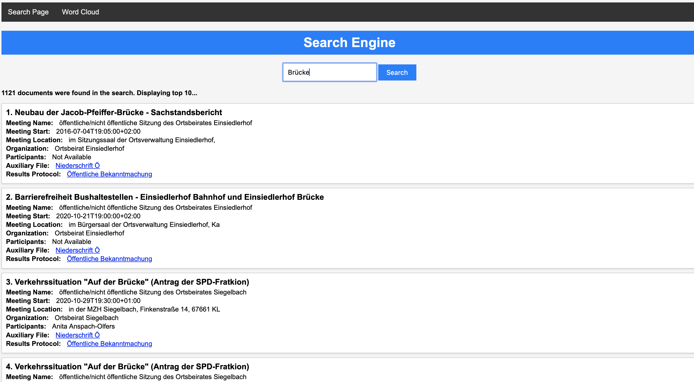
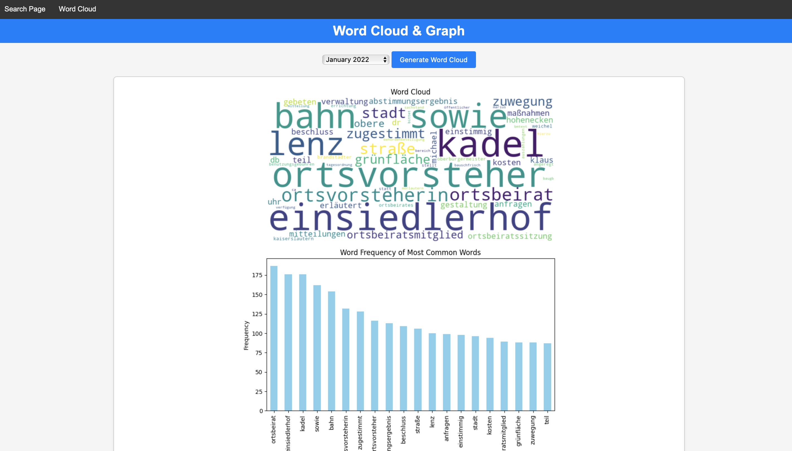

# Flask Application with Elasticsearch Integration and Word Cloud Generation

This project is a web-based search engine with additional features like word cloud generation and result listing. It is built using Flask, Elasticsearch, and includes a word cloud generator.

# Features
Search Page:

Allows users to enter a search query.
Displays a list of search results with details like meeting name, start time, location, organization, participants, auxiliary files, and results protocol.
# Pagination:

Supports pagination for the search results.
# Word Cloud Page:

Generates a word cloud based on selected month/year or the entire year.




## Requirements

- Flask
- Elasticsearch
- wordcloud
- nltk
- matplotlib

## Description

### Backend (`app.py`):

**Setup and Dependencies:**
- The application initializes Flask and establishes a connection to an Elasticsearch instance running locally.
- The nltk library is used to download and setup German stopwords.

**Functions:**
- `clean_text`: Cleans the provided text by removing special characters, converting to lowercase, and removing German stopwords.

**Routes:**
- `@app.route('/')`: Renders the main search page (`index.html`).
- `@app.route('/search', methods=['POST'])`: Handles the search query and returns relevant documents from Elasticsearch.
- `@app.route('/generate-word-cloud', methods=['POST'])`: Generates a word cloud based on the content from a selected month.

### Frontend (`index.html`):

**UI:**
- Contains a form to search Elasticsearch.
- Contains another form to select a month and generate a word cloud.
- Displays the search results or the generated word cloud based on user actions.

**JavaScript:**
- Uses vanilla JavaScript to handle form submissions asynchronously (AJAX) without refreshing the page.
- Displays the search results or the word cloud in the corresponding container.

## Running the Application

1. Start your Elasticsearch server.
2. Run the Flask application:
```bash
python app.py
```
3. The application will be accessible at http://localhost:5000.

```bash
pip install flask elasticsearch wordcloud nltk matplotlib
```
Note: HK  found modules _scikit-learn_ and _pandas_ were missing, too. So I additionally had to:
```bash
pip install scikit-learn pandas
```
